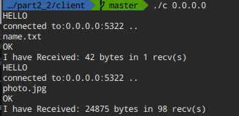
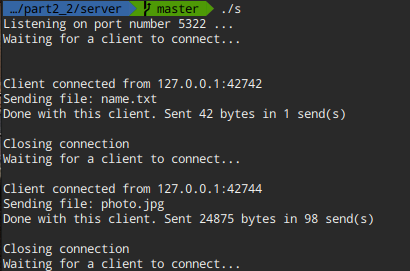

#LAB 1 Part 2

## CSD 304 - Computer Networks

## Submitted by: Rohan Verma (1510110508)

##Solution

### Makefile

```makefile

makelab: server/server.c client/client.c
	rm -f server/s
	rm -f client/c
	gcc server/server.c -o server/s
	gcc client/client.c -o client/c
	rm -f client/name.txt 
	rm -f client/photo.jpg 
	rm -f client/*.txt

```

### server.c

```c
#include <stdio.h> /* printf and standard i/o */
#include <sys/socket.h> /* socket, bind, listen, accept, socklen_t */
#include <arpa/inet.h> /* sockaddr_in, inet_ntop */
#include <string.h> /* strlen */
#include <stdlib.h> /* atoi, EXIT_FAILURE */
#include <fcntl.h> /* open, O_RDONLY */
#include <unistd.h> /* close, read */
#define SRV_PORT 5322 /* default port number */
#define LISTEN_ENQ 5 /* for listen backlog */
#define MAX_RECV_BUF 256
#define MAX_SEND_BUF 256

void get_file_name(int sock, char* file_name)
{
	char recv_str[MAX_RECV_BUF]; /* to store received string */
 	ssize_t rcvd_bytes; /* bytes received from socket */

 	/* read name of requested file from socket */
	if ( (rcvd_bytes = recv(sock, recv_str, MAX_RECV_BUF, 0)) < 0) {
		perror("recv error");
		return;
	}

	sscanf (recv_str, "%s\n", file_name); /* discard CR/LF */
}


int send_file(int sock, char *file_name)
{
	int sent_count; /* how many sending chunks, for debugging */
 	ssize_t read_bytes, /* bytes read from local file */
 	sent_bytes, /* bytes sent to connected socket */
	sent_file_size;
	char send_buf[MAX_SEND_BUF]; /* max chunk size for sending file */
	char * errmsg_notfound = "FNF\n";
 	int f; /* file handle for reading local file*/
	sent_count = 0;
	sent_file_size = 0;
	/* attempt to open requested file for reading */
 	if( (f = open(file_name, O_RDONLY)) < 0) /* can't open requested file */
	{
		perror(file_name);
		if( (sent_bytes = send(sock, errmsg_notfound , strlen(errmsg_notfound), 0)) < 0 )
		{
			perror("send error");	
			return -1;
		}
	}
 	else /* open file successful */
	{
		printf("Sending file: %s\n", file_name);
		while( (read_bytes = read(f, send_buf, MAX_RECV_BUF)) > 0 )
		{
			if( (sent_bytes = send(sock, send_buf, read_bytes, 0)) < read_bytes )
			{
					perror("send error");
					return -1;
			}
			sent_count++;
			sent_file_size += sent_bytes;
		}
		close(f);
 	} /* end else */

	printf("Done with this client. Sent %d bytes in %d send(s)\n\n", sent_file_size, sent_count);
	return sent_count;
}


int main(int argc, char* argv[])
{
	int listen_fd, conn_fd;
	struct sockaddr_in srv_addr, cli_addr;
	socklen_t cli_len;
 	char file_name [MAX_RECV_BUF]; /* name of the file to be sent */
 	char print_addr [INET_ADDRSTRLEN]; /* readable IP address */
 	memset(&srv_addr, 0, sizeof(srv_addr)); /* zero-fill srv_addr structure*/
 	memset(&cli_addr, 0, sizeof(cli_addr)); /* zero-fill cli_addr structure*/
	srv_addr.sin_family = AF_INET;
	srv_addr.sin_addr.s_addr = htonl(INADDR_ANY);
	 /* if port number supplied, use it, otherwise use SRV_PORT */
	srv_addr.sin_port = (argc > 1) ? htons(atoi(argv[1])) : htons(SRV_PORT);
	if ( (listen_fd = socket(AF_INET, SOCK_STREAM, IPPROTO_TCP)) < 0) {
		perror("socket error");
		exit(EXIT_FAILURE);
	}
 	/* bind to created socket */
	if( bind(listen_fd, (struct sockaddr*) &srv_addr, sizeof(srv_addr)) < 0 ){
		perror("bind error");
		exit(EXIT_FAILURE);
	}

	printf("Listening on port number %d ...\n", ntohs(srv_addr.sin_port));
	if( listen(listen_fd, LISTEN_ENQ) < 0 ) {
		perror("listen error");
		exit(EXIT_FAILURE);
	}

 	for( ; ; ) /* run forever*/
	{
		cli_len = sizeof(cli_addr);
		printf ("Waiting for a client to connect...\n\n");
 		/* block until some client connects */
		if ( (conn_fd = accept(listen_fd, (struct sockaddr*) &cli_addr, &cli_len)) < 0 )
		{
			perror("accept error");
 			break; /* exit from the for loop */
		}

 		/* convert numeric IP to readable format for displaying */
		inet_ntop(AF_INET, &(cli_addr.sin_addr), print_addr, INET_ADDRSTRLEN);
		printf("Client connected from %s:%d\n",
			print_addr, ntohs(cli_addr.sin_port) );

		get_file_name(conn_fd, file_name);
		send_file(conn_fd, file_name);
		printf("Closing connection\n");
 		close(conn_fd); /* close connected socket*/
	} /* end for */

 	close(listen_fd); /* close listening socket*/
	return 0;
}

```

### client.c

```c
#include <stdio.h> 
#include <sys/socket.h> /* socket, connect, socklen_t */
#include <arpa/inet.h> /* sockaddr_in, inet_pton */
#include <string.h> 
#include <stdlib.h> /* atoi */
#include <fcntl.h> /* O_WRONLY, O_CREAT */
#include <unistd.h> /* close, write, read */
#define SRV_PORT 5322
#define MAX_RECV_BUF 256
#define MAX_SEND_BUF 256

int recv_file(int sock, char* file_name)
{
 	char send_str [MAX_SEND_BUF]; /* message to be sent to server*/
 	int f; /* file handle for receiving file*/
	ssize_t sent_bytes, rcvd_bytes, rcvd_file_size;
 	int recv_count; /* count of recv() calls*/
 	char recv_str[MAX_RECV_BUF]; /* buffer to hold received data */
 	size_t send_strlen; /* length of transmitted string */

 	sprintf(send_str, "%s\n", file_name); /* add CR/LF (new line) */
 	send_strlen = strlen(send_str); /* length of message to be transmitted */
	if( (sent_bytes = send(sock, file_name, send_strlen, 0)) < 0 ) {
		perror("send error");
		return -1;
	}
 	/* attempt to create file to save received data. 0644 = rw-r--r-- */
	if ( (f = open(file_name, O_WRONLY|O_CREAT, 0644)) < 0 )
	{
		perror("error creating file");
		return -1;
	}

 	recv_count = 0; /* number of recv() calls required to receive the file */
 	rcvd_file_size = 0; 

 	int keep_file = 1;
	while ( (rcvd_bytes = recv(sock, recv_str, MAX_RECV_BUF, 0)) > 0 )
	{
		recv_count++;
		rcvd_file_size += rcvd_bytes;
		if(strcmp(recv_str, "FNF\n") == 0){
			printf("File not found\n");
			keep_file = 0;
			break;
		}
		else if(keep_file == 1){
			printf("OK\n");
			keep_file = 2;
		}

		if (write(f, recv_str, rcvd_bytes) < 0 )
		{
			perror("error writing to file");
			return -1;
		}
	}
 	close(f); /* close file*/
 	if(!keep_file) remove(file_name);
 	else{
		printf("I have Received: %d bytes in %d recv(s)\n", rcvd_file_size, recv_count);
	}
	return rcvd_file_size;
}

int main(int argc, char* argv[])
{

		int sock_fd;
		struct sockaddr_in srv_addr;

		if (argc < 2)
		{
			printf("usage: %s <IP address> [port number]\n", argv[0]);
			exit(EXIT_FAILURE);
		}
	 	memset(&srv_addr, 0, sizeof(srv_addr)); /* zero-fill srv_addr structure*/
	for(;;){
	 	/* create a client socket */
		sock_fd = socket(AF_INET, SOCK_STREAM, IPPROTO_TCP);
	 	srv_addr.sin_family = AF_INET; /* internet address family */

	 	/* convert command line argument to numeric IP */
		if ( inet_pton(AF_INET, argv[1], &(srv_addr.sin_addr)) < 1 )
		{
			printf("Invalid IP address\n");
			exit(EXIT_FAILURE);
		}

	 	/* if port number supplied, use it, otherwise use SRV_PORT */
		srv_addr.sin_port = (argc > 2) ? htons(atoi(argv[2])) : htons(SRV_PORT);

		if( connect(sock_fd, (struct sockaddr*) &srv_addr, sizeof(srv_addr)) < 0 )
		{
			perror("connect error");
			exit(EXIT_FAILURE);
		}
		printf("HELLO\nconnected to:%s:%d ..\n",argv[1],SRV_PORT);

		char file_name[100];
		scanf("%s", &file_name);
		if(strcmp(file_name, "Bye") == 0) break;
	 	recv_file(sock_fd, file_name); /* argv[1] = file name */

	 	/* close socket*/
		if(close(sock_fd) < 0)
		{
			perror("socket close error");
			exit(EXIT_FAILURE);
		}
	}
	return 0;
}
```

## Screenshots




